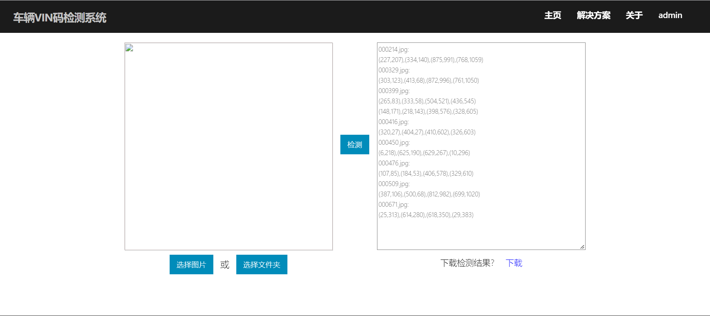

# MEAST
The code implementation for MEAST. We weil add how to train soon.

The images of VIN detection demo are follows.

Below is a demo video of the APP running in mobile phone.

<video id="video" controls="" preload="none" poster="https://i.vimeocdn.com/video/862586401_640x360.jpg">
      <source id="mp4" src="https://gzc-download.weiyun.com/ftn_handler/4172f99714837bfe77b3284a78733bfb4c12550b163ca17bc4f52aaff067fb04/Iceland%20-%2033191-1.mp4?fname=Iceland%20-%2033191-1.mp4&from=30111&version=3.3.3.3" type="video/mp4">
</video>

